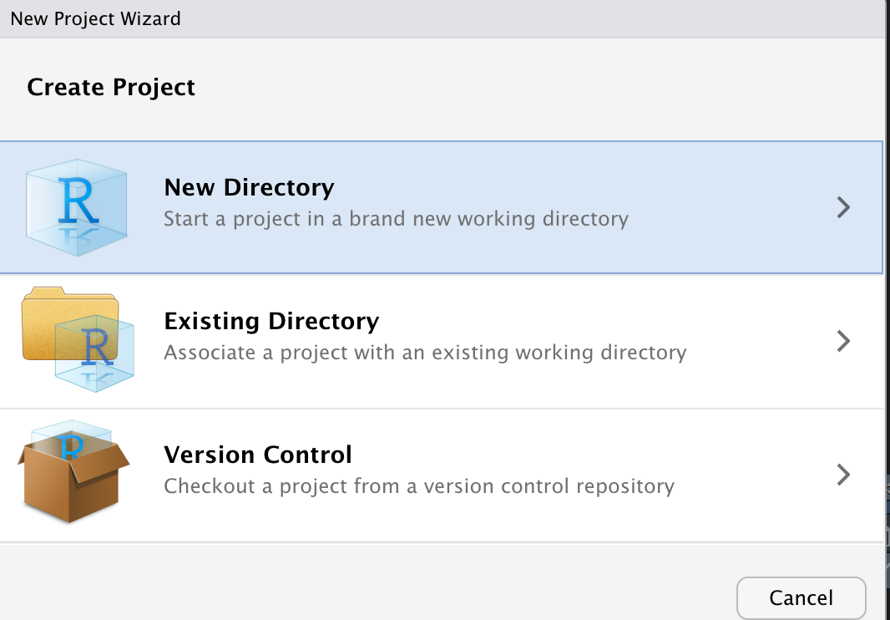
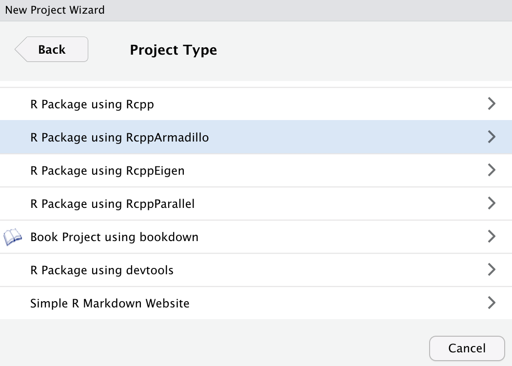
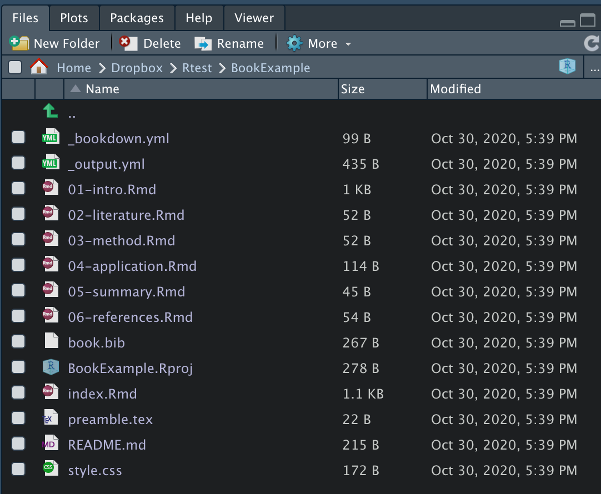
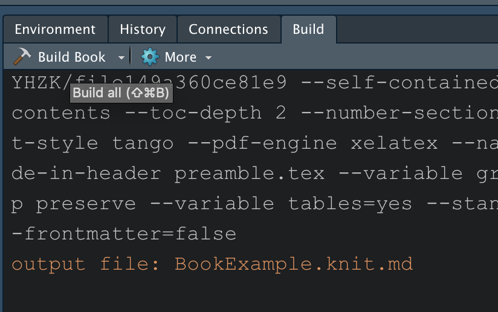
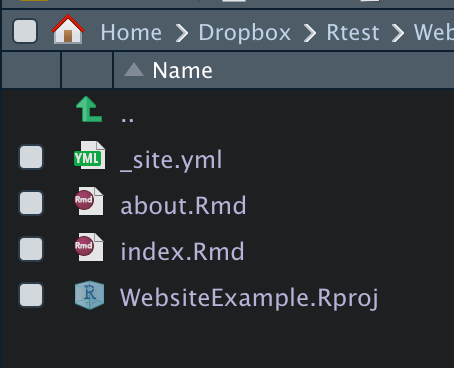
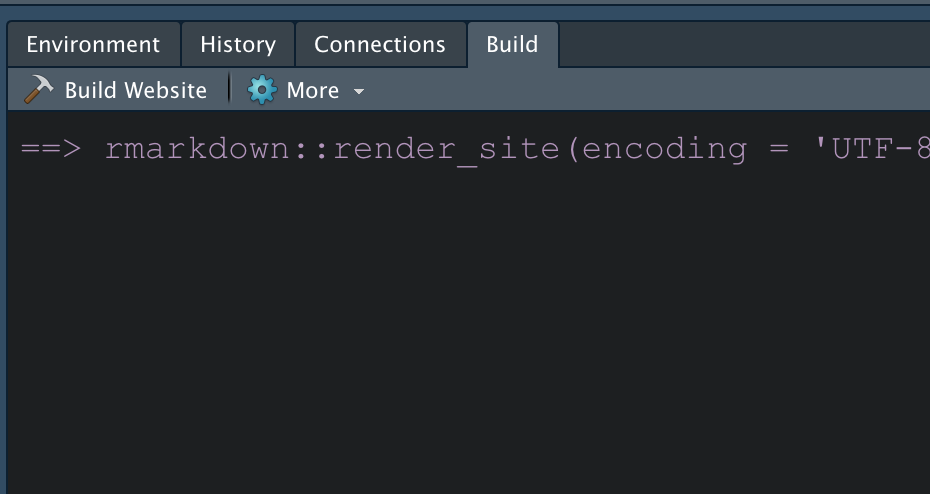
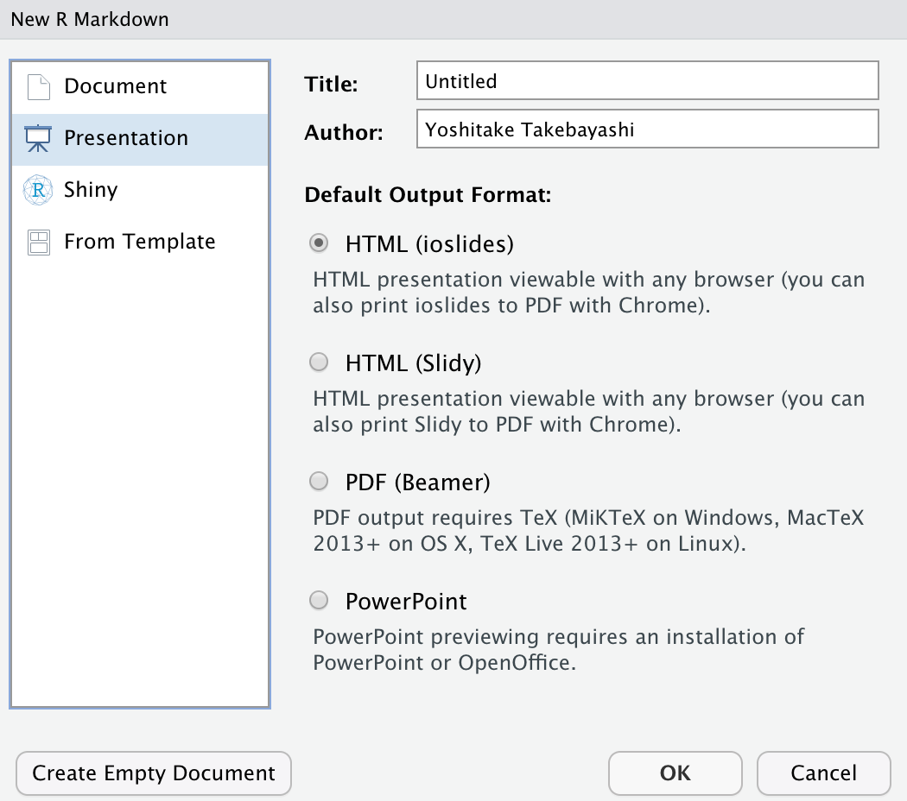
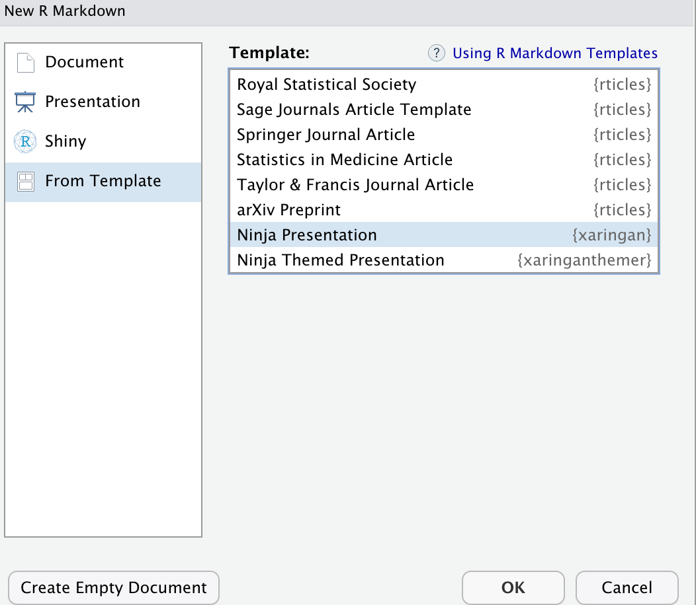
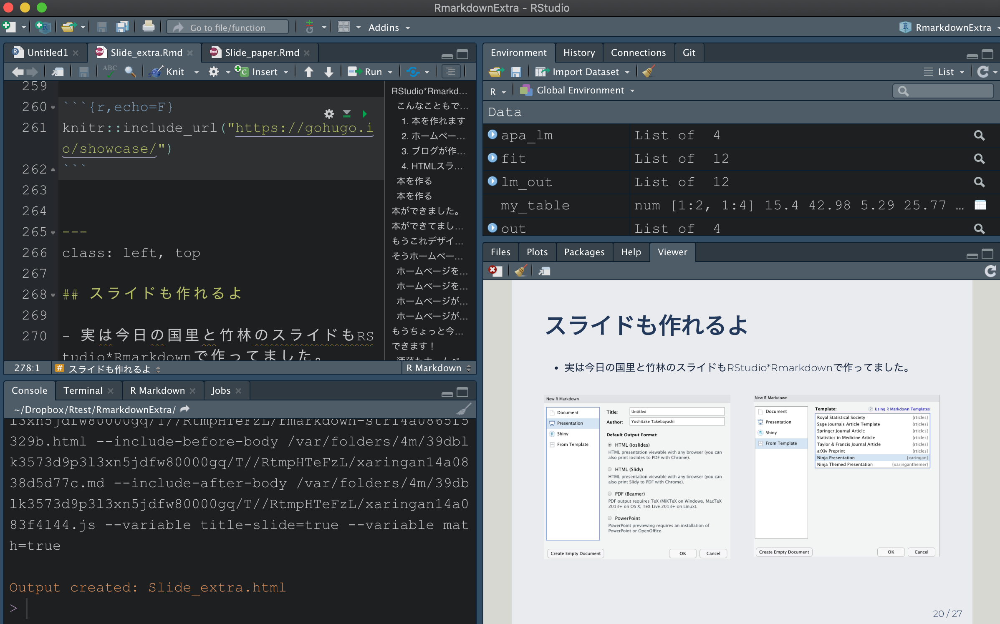
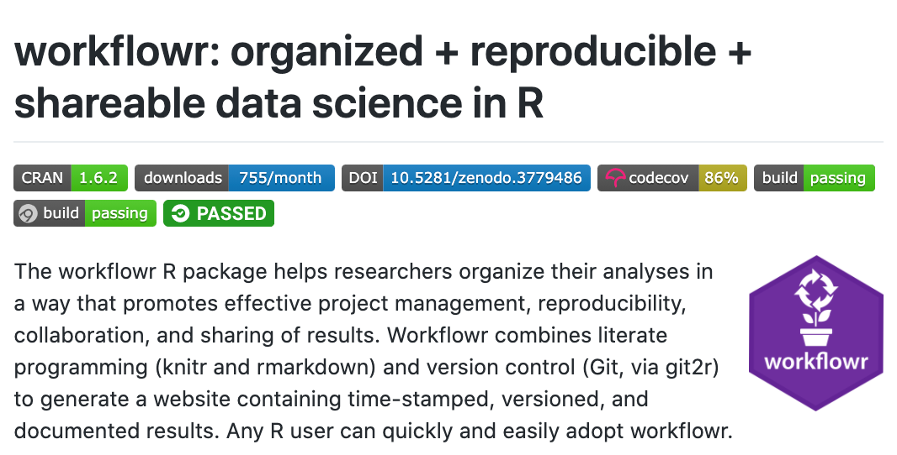

background-image: url(https://pbs.twimg.com/media/CasouLgUEAQvHrL.png)

```{css, echo=F}
pre code, pre, code {
  white-space: pre !important;
  overflow-x: scroll !important;
  word-break: keep-all !important;
  word-wrap: initial !important;
}
```

```{r setup, include=FALSE}
options(htmltools.dir.version = FALSE)
```


```{r xaringan-themer, include=F}
library(xaringanthemer)
style_mono_light(base_color = "#23395b",
  header_font_google = google_font("Noto Sans JP"),
  text_font_google   = google_font("Montserrat", "300", "300i"),
  code_font_google   = google_font("Fira Mono")
)
```


```{r, include=FALSE}
options(htmltools.dir.version = FALSE)
```

???

Image credit: [Wikimedia Commons](https://commons.wikimedia.org/wiki/File:Sharingan_triple.svg)

---
class: inverse, center, middle

# RStudio*Rmarkdownのポテンシャル

---
class: left, top

## こんなこともできます
### 　1. 本を作れます
### 　2. ホームページを作れます
### 　3. ブログが作れます。
### 　4. HTMLスライドを作れます


---
class: left, top

## 本を作る

- 詳細はこちらの[bookdown](https://bookdown.org/home/about/)のサイトから

```{r}
# remotes::install_cran("bookdown")
library(bookdown)
```

- **[FIle]** >>> **[New Project...]** >>> **[New Directory...]**  >>>   
       **[Book Project using Book Down]** 


.pull-left[
```{r,echo=F}

```
]

.pull-right[
```{r,echo=F}

```
]

---
class: left, top


## 本を作る

.pull-left[
- 新規のプロジェクトディレクトリに本作成に必要なファイルがドン
```{r,echo=F}

```
]


.pull-right[
- とりま Build Book !!
```{r,echo=F}

```
]


---
class: left, top

# 本ができました。

- htmlで読める本
- pdfやepub形式にダウンロード可能

<video width="700" align="center" height="400" controls>
  <source src="img/mov1.mov" type="video/mp4">
</video>

---
class: left, top

# 本ができてました。

- もちろんgithubを通じてウェブページとしてアップロード可能
- これもこれで作りました(国里さんが)

```{r,echo=F}
knitr::include_url("https://ykunisato.github.io/jpa2020-tws-002/")
```


---
class: inverse, middle

# もうこれデザイン次第でHP！！


---
class: inverse, middle
# そうホームページ作れるの


---
class: left, top
## ホームページを作ります

- **[FIle]** >>> **[New Project...]** >>> **[New Directory...]**  >>>   
       **[Simple Rmarkdown Website]** 


.pull-left[
```{r,echo=F}

```
]

.pull-right[
```{r,echo=F}

```
]

---
class: left, top

## ホームページを作ります

.pull-left[
- 新規のプロジェクトディレクトリに本作成に必要なファイルがちょこん
```{r,echo=F}

```
]


.pull-right[
- とりま Build Website !!
```{r,echo=F}

```
]

---
class: left, top

## ホームページができました。

- YAMLで指定し, Rmdファイルを追加してタブを増やすのも簡単

<video width="700" align="center" height="400" controls>
  <source src="img/mov2.mov" type="video/mp4">
</video>


---
class: left, top

## ホームページができてました。

```{r,echo=F}
knitr::include_url("https://ytake2.github.io/Rsite/_site/index.html")
```

---
class: inverse, middle
# もうちょっと今風なシュッとしたスタイルのHPがいいな〜

---
class: inverse, middle

# できます！

---
class: left, top

##　洒落たホームページ作る

- 詳細はこちらの[blogdown](https://bookdown.org/yihui/blogdown/)のサイトから

```{r}
#remotes::install_cran("blogdown")
library(blogdown)
blogdown::install_hugo()
```
  
  
- **[FIle]** >>> **[New Project...]**


```{r, results='hide'}
blogdown::new_site()
```


---
class: left, top

# ブログサイトができました。
<video width="700" align="center" height="400" controls>
  <source src="img/mov3.mov" type="video/mp4">
</video>


---
class: left, top

### Hugoから色んなデザインを選べます。

```{r,echo=F}
knitr::include_url("https://themes.gohugo.io/")
```


---
class: left, top

## スライドも作れるよ

- 実は今日の国里と竹林のスライドもRStudio*Rmarkdownで作ってました。


.pull-left[
```{r,echo=F}

```
]

.pull-right[
```{r,echo=F}

```
]

---
class: left, top

## スライドも作れるよ

- 実は今日の国里と竹林のスライドもRStudio*Rmarkdownで作ってました。


```{r,echo=F}

```

---
class: left, top

## こんなこともできました
### 　1. 本を作れました
### 　2. ホームページを作れました
### 　3. ブログが作れました
### 　4. HTMLスライドを作れました


---
class: inverse, middle

# これらの技術が

---
class: inverse, middle

# 再現可能性向上を

---
class: inverse, middle

# 加速する!?


---
class: left, top

## [workflowrパッケージ](https://github.com/jdblischak/workflowr)


```{r,echo=F}

```


---
class: left, top

## workflowrのExample page

```{r,echo=F}
knitr::include_url("https://stephenslab.github.io/wflow-divvy/index.html")
```

---
class: left, top

## workflowrの使い方


```{r,echo=F}
knitr::include_url("https://ytake2.github.io/takeblog/2019/12/21/crm-stan-trialr/")
```


---
class: inverse, middle

# RStudio*Rmarkdownで再現可能な執筆環境のもとで心理学研究を楽しみましょう！


---
class: inverse, middle

# Enjoy!!


